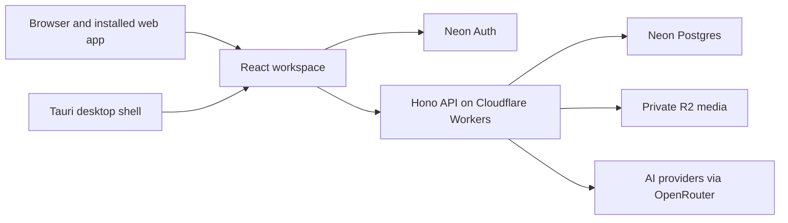

<p align="center">
  
</p>

<h1 align="center">Cadence</h1>

<p align="center"><strong>Built for the real you, not the perfect one.</strong></p>
<p align="center">Plans that bend with you, through the bright days and the quiet ones.</p>

<p align="center">
  <a href="https://dashboard.cadenceapp.cloud">Open Cadence</a> ·
  <a href="https://cadenceapp.cloud">Visit the website</a> ·
  <a href="./CHANGELOG.md">See what's new</a> ·
  <a href="https://github.com/toricodesthings/Cadence/releases">Desktop releases</a>
</p>

<p align="center">
  <a href="./LICENSE"></a>
</p>

Cadence is a calm planning workspace for the days that go to plan and the days that don't. Capture a thought before it disappears, give it a place when you're ready, and see your tasks, time, and routines together. Depth is there when you want it; a single line is enough to begin.

> [!NOTE]
> Cadence is free and in beta. The [changelog](./CHANGELOG.md) is the source of truth for shipped changes; the [Terms](https://cadenceapp.cloud/terms) explain the limits of the hosted service.

## Find your way

[Explore the app](#explore-the-app) · [Use it your way](#use-it-your-way) · [Run it locally](#run-it-locally) · [How it's built](#how-its-built) · [Contribute](#contribute)

## Explore the app

| A place for… | What you can do |
| --- | --- |
| **Capture** | Set down thoughts and tasks with no day yet. Use natural language, keep a thought as a note, or place it on a suggested day later. |
| **Today & Upcoming** | See what belongs to this day and what is ahead. Carried-over work appears as **Still open**, without taking over the page. |
| **Lists & tags** | Give tasks context with lists, sections, subtasks, notes, and tags. Switch between rows and boards when that helps. |
| **Schedule & Events** | See tasks, routines, fixed time blocks, and events together across day, week, month, and year views. |
| **Routines** | Check in, skip a day, pause for a while, or add steps. Review your week or month without turning a missed day into a verdict. |
| **Weekly Reset** | Clear what has accumulated and step into the week with less on your mind. |

> **“Capture anything. Clarify later. Place when ready.”**

Cadence also has **Focus views**, a searchable notification center, **Trash** with restore and permanent delete controls, and keyboard search with <kbd>⌘</kbd>/<kbd>Ctrl</kbd> + <kbd>K</kbd>. On phones, the dock keeps Capture, Schedule, the assistant, Routines, and Browse close at hand.

### Ask Emilie

The Cadence Assistant can look across your workspace, help plan a busy week, organize Capture, and work with tasks, lists, routines, events, and more. Send a photo of a whiteboard or syllabus and ask it to turn what it sees into tasks. Its default **Ask first** mode shows proposed changes for your approval; **Auto** and **Full** are available if you choose them.

You can also [connect an outside assistant through MCP](./CHANGELOG.md) and choose what it may read or change in **Settings › Integrations**. Disconnect it there at any time.

## Use it your way

- **Keep going offline.** The web app and desktop app can open with a recent window of your workspace. Everyday edits wait to sync; a cloud mark and sync review show what is pending or needs attention. Some actions, including assistant requests and settings changes, need a connection.
- **Make the space yours.** Pick a palette or a seasonal loading scene, use daylight mode, or crop your own photo for the background. Adjust blur, brightness, and accent colours in **Appearance**.
- **Stay in control of your data.** In **Settings › Data & Export**, request a JSON copy by email or delete your account with a typed confirmation. **Privacy & Data** includes a switch for usage diagnostics. Read the [Privacy Policy](https://cadenceapp.cloud/privacy) for how storage, diagnostics, and AI providers work.
- **Choose your surface.** Use Cadence in a browser, add the web app to your phone's Home Screen, or use the [Tauri desktop app](https://github.com/toricodesthings/Cadence/releases) for native shortcuts, a quick-capture window, and updates.

<details>
<summary><strong>What changed recently?</strong></summary>

Recent releases brought offline editing and sync review, connected assistants, routine steps, photo input for Emilie, account export and deletion, and more control over appearance and desktop updates. The [full changelog](./CHANGELOG.md) records every release and also powers the in-app **Changelog** view.

</details>

## Run it locally

**Requirements:** Node.js 22.22.0 or newer and Corepack/pnpm. Running the full workspace also needs development credentials and bindings for Neon Auth, Neon Postgres, and Cloudflare Workers; see the [backend environment guide](./apps/backend/AGENTS.md#14-environment--bindings) and [frontend guide](./apps/frontend/AGENTS.md).

```bash
corepack enable
pnpm install
pnpm dev
```

`pnpm dev` starts the frontend at `http://localhost:8788` and the API at `http://localhost:8787`.

<details>
<summary><strong>Other workspace commands</strong></summary>

```bash
pnpm dev:frontend       # Web app only
pnpm dev:backend        # API only
pnpm dev:desktop:full   # API and Tauri desktop app; requires the Rust/Tauri toolchain
pnpm dev:landing        # Website

pnpm typecheck          # Check workspace types
pnpm lint               # Lint the workspace
pnpm test               # Run workspace tests
pnpm build              # Build workspace apps and packages
```

</details>

## How it's built



The frontend and desktop app share the same UI and product logic. The API uses shared contracts, validates requests, and scopes workspace data to the signed-in account with Postgres row-level security. Assistant content is sent to AI providers when you use the assistant; details are in the [Privacy Policy](https://cadenceapp.cloud/privacy).

| Workspace | Where to start |
| --- | --- |
| Web app | [Frontend README](./apps/frontend/README.md) |
| API and database | [Backend README](./apps/backend/README.md) |
| Native shell | [Desktop README](./apps/desktop/README.md) |
| Shared contracts and domain rules | [Packages README](./packages/README.md) |

## Contribute

Issues and pull requests are welcome. Start with the relevant app's `AGENTS.md` and the [repo rules](./AGENTS.md); they describe the current code and conventions. Keep user-facing changes reflected in the [changelog](./CHANGELOG.md). You can [open an issue](https://github.com/toricodesthings/Cadence/issues) to discuss a bug or idea.

Cadence is licensed under [AGPL-3.0-only](./LICENSE). The code license does not grant rights to the Cadence name or logo. The hosted app has its own [Terms](https://cadenceapp.cloud/terms) and [Privacy Policy](https://cadenceapp.cloud/privacy).

<p align="center"><em>Built with care for the beautifully inconsistent.</em></p>
